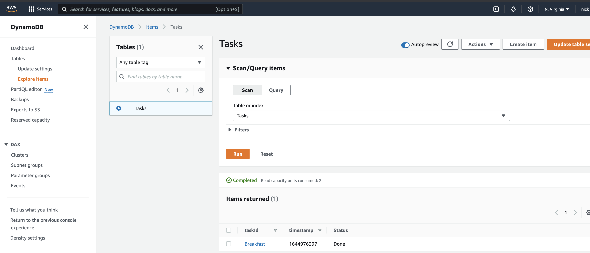

# AWS Lambda, Step Functions, DynamoDB, and CDK!

Example project of an AWS Lambda triggering the execution of a Step Function.  The Step Function contains tasks that insert and update items in the DynammDB table `Tasks`.  The AWS resources are deployed using the [AWS CDK](https://aws.amazon.com/cdk).  The main stack is defined in the file [aws-stepfunction-status-stack.ts](./lib/aws-stepfunction-status-stack.ts).

## Build & Deploy

Install npm modules

```sh
npm install
```

Compile typescript to js

```sh
npm run build
```

Deploy this stack to your default AWS account/region

```sh
cdk deploy
```

## DynamoDB

The following code in [aws-stepfunction-status-stack.ts](./lib/aws-stepfunction-status-stack.ts) defines the DynamoDB `Tasks` table.

```typescript
const dynamoTable = new Table(this, 'Tasks', {
      partitionKey: {
        name: 'taskId',
        type: AttributeType.STRING
      },
      sortKey: {
        name: 'timestamp',
        type: AttributeType.NUMBER
      },
      tableName: 'Tasks',
    });
```

The primary key for the `Tasks` table is the taskId.  The sort key is the unix time represented as a number.  The above code will produce the following DynamoDB table.


## Step Function

The step function consists of a combination of the following.
* [DynamoPutItem](https://docs.aws.amazon.com/cdk/api/v2/docs/aws-cdk-lib.aws_stepfunctions_tasks.DynamoPutItem.html)
* [DynamoUpdateItem](https://docs.aws.amazon.com/cdk/api/v2/docs/aws-cdk-lib.aws_stepfunctions_tasks.DynamoUpdateItem.html)
* [Wait](https://docs.aws.amazon.com/cdk/api/v2/docs/aws-cdk-lib.aws_stepfunctions.Wait.html)

When assembled together in [aws-stepfunction-status-stack.ts](./lib/aws-stepfunction-status-stack.ts), the step function looks like the following.


## Lambda

The lambda function is written in Go and is responsible for starting the execution of the step function (see [main.go](./lambdas/invoke/main.go)).  The Lambda function handler will process events with the following json structure.

```json
{
  "taskId": <id>
}
```

When the function is invoked, the Lambda runs the handler method. The handle method prepares the following json to be passed as the inital state to the step function.

```json
{
  "taskId": <id>,
  "timestamp": <unix time stamp>
}
```

### Invoking the lambda function

In order to invoke the lambda function, navigate to the console and navigate to the `Test` tab.


Add the following json in the `Test Event` panel and then click the `Test` button.

```json
{
  "taskId": "Breakfast"
}
```

Next, expand the `Execution result` details panel.  You will see the output of the log message in the lambda function.


The state machine will go through the following states.

#### Create Dynamo Task Item

In this tast, the dynamodb item is created in the `Tasks` table.


#### Execute long running task...wait 30 seconds

In this task, we simulate a long running task by waiting 30 seconds.  The `Tasks` table is not updated at this time.

#### Update Dynamo Task Item

The task is complete, and we mark set the Status to `Done`.





## Useful Links
<https://docs.aws.amazon.com/step-functions/latest/dg/concepts-states.html>

<https://docs.aws.amazon.com/step-functions/latest/dg/connect-ddb.html>

<https://docs.aws.amazon.com/lambda/latest/dg/lambda-golang.html>

<https://docs.aws.amazon.com/step-functions/latest/dg/concepts-invoke-sfn.html>

<https://pkg.go.dev/github.com/aws/aws-sdk-go-v2/service/sfn>

<https://github.com/aws/aws-sdk-go-v2/tree/main/service/sfn>

<https://docs.aws.amazon.com/amazondynamodb/latest/developerguide/Expressions.UpdateExpressions.html>

<https://docs.aws.amazon.com/amazondynamodb/latest/APIReference/API_UpdateItem.html>

<https://docs.aws.amazon.com/step-functions/latest/dg/amazon-states-language-intrinsic-functions.html>

